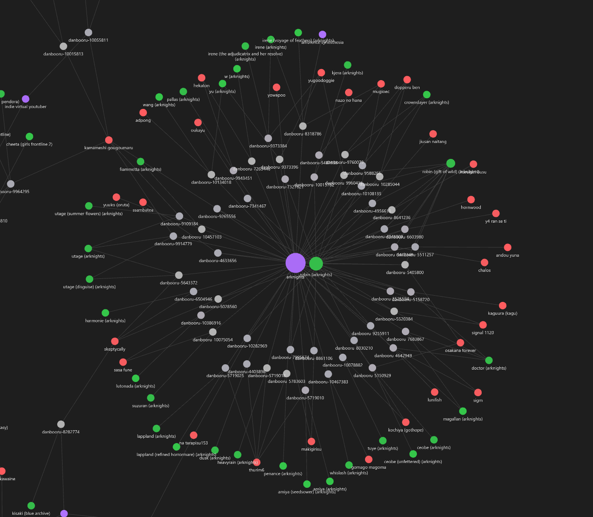
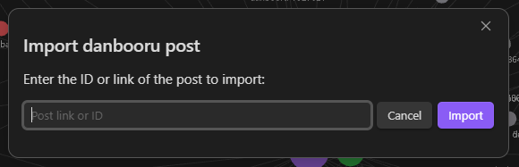
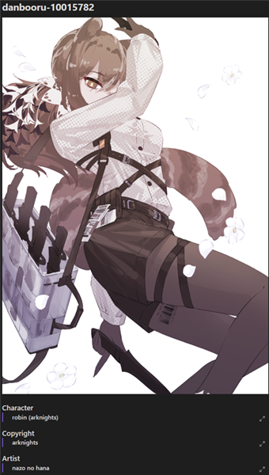

# Danbooru Import

# Quick Start
1. Click the new ribbon that appears in the sidebar / Use the `Danbooru Import: Import danbooru post` command.
2. Use the modal to import the post via link or ID.

# About
[Danbooru](https://danbooru.donmai.us) gives users access to millions of artworks, all referenced in one place. 

__Danbooru Import__ allows Obsidian users to import posts they like into their vaults, either for archiving purposes 
or simply to write down the artists and save artworks they enjoy. Tags included!

In addition to automated imports, Danbooru Import adapts to most vaults by supporting static attributes, custom paths, and tag toggling.

# Recommended Plugins
Because __Danbooru Import__ doesn’t make visual changes, it is recommended to combine it with other plugins for clarity, such as:

- [Front Matter Title](https://github.com/snezhig/obsidian-front-matter-title) _by Snezhig_: Lets you define a title in frontmatter to be displayed as the filename.
  - _Works great with custom `Binary attributes` in the plugin options._
- [Custom Node Size]() _by jackvonhouse_: customize nodes size for improved graph understanding.
	- _Also works with `Binary attributes`._
- [Extended Graph](https://github.com/ElsaTam/obsidian-extended-graph) _by Kapirklaa_: extends the features of the core Graph View.
  - _Useful for previewing embedded artworks in the Graph View._

# Options
In the Community Plugins tab, an entry `Danbooru Import` is present. Among its options are:

- Image folder path.
- Image metadata path.
- Tag metadata path.
- Image name template.
- Image metadata name template.
- Image format.
- Tag filtering by type.
- Custom attributes to include in the image metadata file.

# Usage
After enabling the plugin, a new sidebar ribbon and a command (`Ctrl+P`) will appear:

 

Both of them open a new modal window:

The input accepts any Danbooru post link or a post ID:
- `0000000`
- `danbooru.donmai.us/posts/0000000`
- `https://danbooru.donmai.us/posts/0000000?q=artist`

As a result, _three_ types of files will be created:
- the image downloaded from Danbooru
- a metadata file for each saved tag, 
- and a binary metadata file that links all the data together:

# Support
My future plugins, like this one, will be open-source and free.

If you’d like to support me financially, I have a [Patreon](https://www.patreon.com).

If you'd rather contribute in other ways, I have a semi-dormant [Discord Server](https://discord.gg/ZEfTmXCvPm) too.

I am also open to paid plugin commissions.
